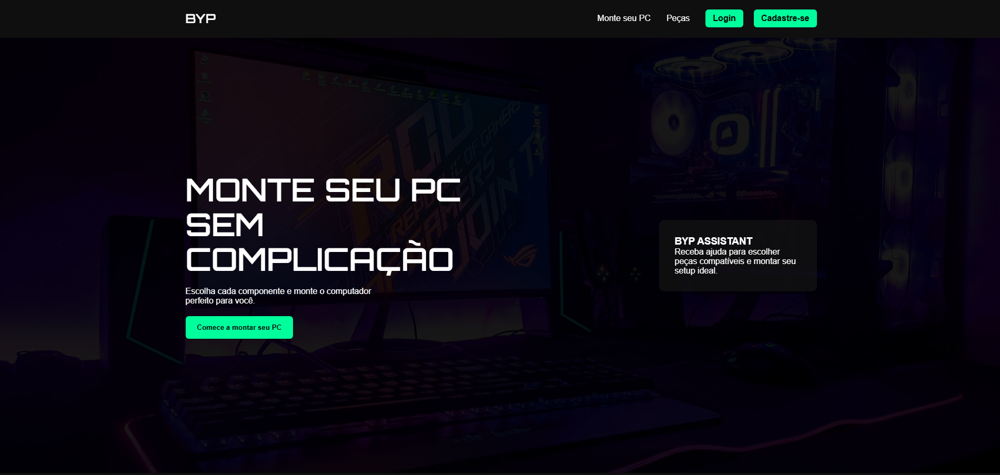
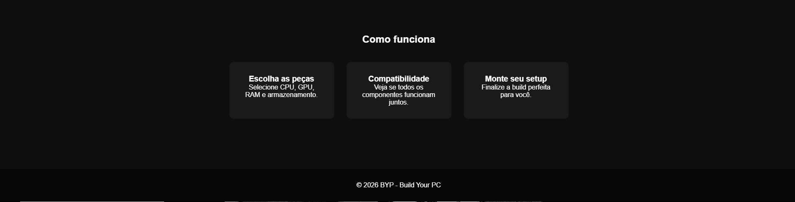
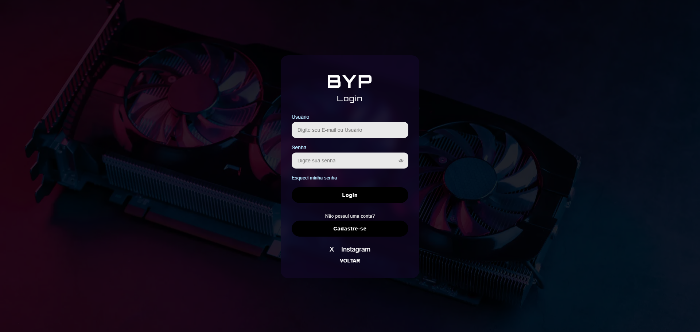
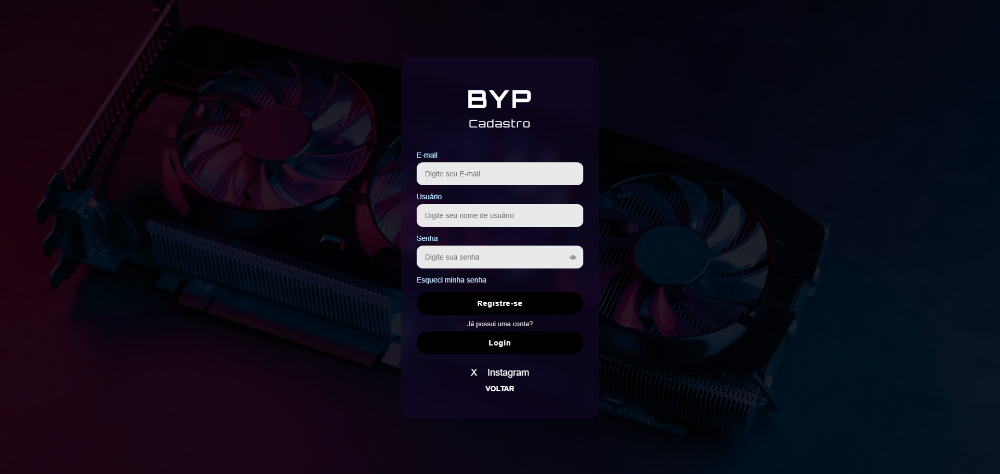

# Projeto Integrador – Protótipo da Interface

Este repositório contém as **primeiras telas do protótipo** do projeto integrador.  
Nesta etapa foi desenvolvida a **estrutura visual da aplicação**, definindo layout, navegação e organização das páginas utilizando apenas HTML e CSS.

O objetivo é criar a base da interface para posteriormente integrar **funcionalidades, backend e banco de dados**.

---

## Preview

Tela inicial - Home

Continuação tela inicial

Tela de login

Tela de cadastro

    

## 🚀 Tecnologias utilizadas

  

  
  
  

---

## Telas desenvolvidas

- Página inicial
- Tela de login
- Tela de cadastro

Essas páginas representam a **fase inicial de prototipagem da interface** do sistema.

---

## Próximas etapas

O projeto será expandido com:

- JavaScript para interatividade
- Backend utilizando **Python (FastAPI)**
- Banco de dados **PostgreSQL**
- Possível uso de **React** para componentes da interface

---

## Status

🚧 Projeto em desenvolvimento – fase inicial de protótipo da interface.