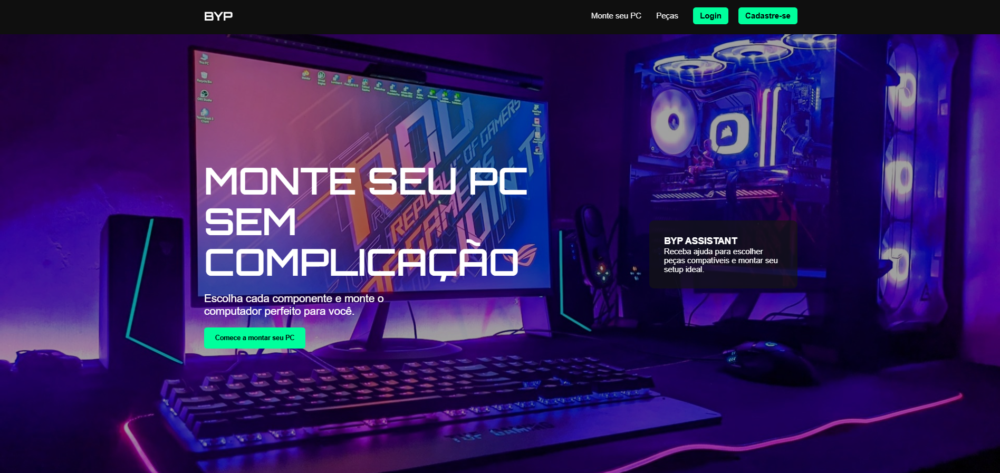

# Projeto Integrador - Faculdade Insted

Este repositório contém as **primeiras telas** do projeto integrador.  
Nesta etapa foi desenvolvida a **estrutura visual da aplicação**, definindo layout, navegação e organização das páginas utilizando apenas JavaScript, HTML e CSS.

O objetivo é criar a base da interface para posteriormente integrar **funcionalidades, backend e banco de dados**.

---

## Preview

Tela inicial - Home

## 🚀 Tecnologias utilizadas

  

  
  
  
  
  

---

## Telas desenvolvidas

- Página inicial
- Tela de login
- Tela de cadastro
- Tela de recuperação de senha
- Tela de perfil do usuário
- Tela de montagem

Essas páginas representam a **fase inicial de prototipagem da interface** do sistema.

---

## Próximas etapas

O projeto será expandido com:

- Backend utilizando **Python (FastAPI)**
- Banco de dados **PostgreSQL**

---

## Status

🚧 Projeto em desenvolvimento – fase inicial de implementação da interface.
